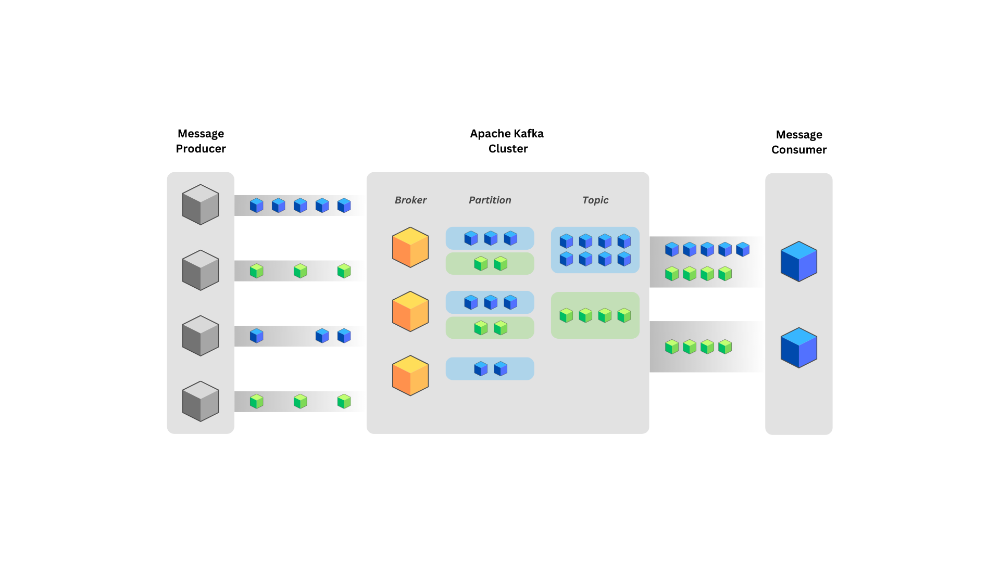

# Apache Kafka Cluster with Docker Compose and Python

This repository provides a minimal setup for an Apache Kafka cluster using Docker Compose. It spins up three Kafka brokers orchestrated by ZooKeeper, along with [Kouncil](https://kouncil.io) as a web interface. You will also find simple Python examples for a producer and a consumer, both using the `confluent-kafka` library. A [`uv`](https://pypi.org/project/uv/) virtual environment is used to manage Python dependencies.



## Table of Contents

- [Apache Kafka Cluster with Docker Compose and Python](#apache-kafka-cluster-with-docker-compose-and-python)
  - [Table of Contents](#table-of-contents)
  - [Prerequisites](#prerequisites)
  - [Setup and Usage](#setup-and-usage)
    - [1. Starting the Kafka Cluster](#1-starting-the-kafka-cluster)
    - [2. Accessing Kouncil](#2-accessing-kouncil)
    - [3. Setting Up the Python Environment](#3-setting-up-the-python-environment)
    - [4. Running the Producer and Consumer](#4-running-the-producer-and-consumer)
  - [Project Structure](#project-structure)
  - [License](#license)

---

## Prerequisites

- Docker and Docker Compose installed.
- Python 3.x installed.
- The `uv` CLI tool for Python environments installed (e.g., `pip install uv`).

## Setup and Usage

### 1. Starting the Kafka Cluster

This repository includes a `kafka_cluster.yml` file that describes the cluster:

```bash
docker-compose -f kafka_cluster.yml up -d
```

This command will:

- Spin up a ZooKeeper instance.
- Spin up three Kafka brokers (`kafka1`, `kafka2`, `kafka3`).
- Launch the Kouncil container as a web interface for observing and managing Kafka.

### 2. Accessing Kouncil

After the cluster has started, you can open [http://localhost:8888](http://localhost:8888) to view the Kouncil dashboard. Here, you can explore the cluster and manage topics visually.

### 3. Setting Up the Python Environment

To run the Python producer and consumer examples, you can use [`uv`](https://pypi.org/project/uv/) to manage a virtual environment. In the repository’s root folder, run:

```bash
uv sync
```

This will create a virtual environment named `.venv` with the dependencies from `pyproject.toml`.

> If you prefer to use a standard virtual environment approach, you can substitute your method of choice (e.g., `python -m venv .venv`) and install the package `confluent-kafka` yourself.

### 4. Running the Producer and Consumer

You will find two Python scripts, `producer.py` and `consumer.py`, that demonstrate a simple producer and consumer using the `confluent-kafka` library.

1. **Producer**  
   Run the producer to send messages to a specified topic. Example:

   ```bash
   uv run producer.py
   ```

2. **Consumer**  
   Run the consumer to listen to messages on the same topic:

   ```bash
   uv run consumer.py
   ```

   The script will output any messages received from Kafka.

## Project Structure

```
.
├── kafka_cluster.yml   # Docker Compose file defining the Kafka cluster
├── producer.py         # Simple Python producer example
├── consumer.py         # Simple Python consumer example
└── README.md           # Project documentation
```

## License

This project is provided under the [MIT License](LICENSE). Feel free to use or modify this repository as needed. 

If you have any questions or encounter any issues, please open an issue on GitHub. Thank you for checking out our minimal Kafka cluster setup!